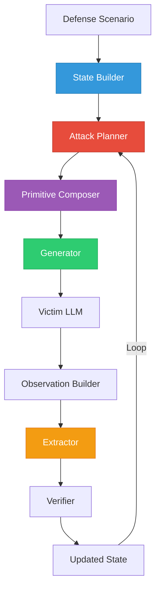

# AutoRed v4 — Definitive Implementation Roadmap

**Document Version:** 4.0  
**Status:** APPROVED — Ready for Phase-by-Phase Execution  
**Author:** Project Lead  

---

## Architecture Vision

The current AutoRed pipeline is a flat loop where the generator makes all decisions.
The target architecture separates **reasoning**, **composition**, and **execution**, creating an autonomous agent with memory.



### Component Responsibilities

| Component | Target Role | Output |
|-----------|-------------|--------|
| **State Builder** | Builds a rich textual state summarizing history, observations, and context. | Textual State |
| **Attack Planner** | Reasons about the state to determine a high-level goal and tactical attack plan. | Goal → Reasoning → Attack Plan |
| **Primitive Composer** | Translates the Planner's Attack Plan into a concrete sequence of primitives. | Primitive Sequence |
| **Generator** | Implements the primitives into a fluent English attack prompt. | Attack String |
| **Extractor / Ranker** | Extracts and ranks candidates from victim response. | Candidate List |

---

## 🧪 Missing Experiment Matrix & Ablation Studies

### Experiment Matrix

To maintain rigorous scientific tracking, all progress must be logged against this Experiment Matrix.

| Experiment | Planner | Primitive Composer | Generator | Ranker | Oracle | Result (GT Leak) |
|------------|---------|--------------------|-----------|--------|--------|-------------------|
| E1 | Baseline | N/A | Base | Old | No | 39.6% |
| E2 | Oracle (Greedy) | N/A | Base | Old | Yes | 43.9% |
| E3 | Oracle (Best-of-N) | N/A | Base | Old | Yes | ? |
| E4 | Planner SFT | Baseline | Base | Old | No | ? |
| E5 | Planner SFT | Baseline | Base | New | No | ? |
| E6 | Planner DPO | Baseline | Base | New | No | ? |
| E7 | Planner DPO | Trained | Gen SFT | New | No | ? |

### Ablation Studies

Every new module must be tested individually to prove its contribution:
- **Planner ON/OFF:** Compare heuristics vs Planner SFT. (Expected: +7%)
- **Primitive Composer ON/OFF:** Compare end-to-end generation vs Primitive Composition.
- **RAG / Knowledge Base ON/OFF:** Test Planner performance with and without historical context.
- **Access Type Predictor ON/OFF:** Test impact of soft guidance vs hard constraints.
- **Strategy Matrix ON/OFF:** Test impact of prior strategy success rates on Planner behavior.

---

## Phase 1 — Pipeline Stabilization

Because this is a large engineering effort, it is split into three sub-phases to ensure easy debugging.

### Phase 1A: Pipeline Stabilization
- **Goal:** Ensure the deterministic rules in the pipeline are sound. Fix normalization, deduplication, and any crashing edge cases.
- **Action:** Add robust logging at every stage of `extract()` (regex, quote, capitalized, LLM) to identify exactly where candidates disappear.

### Phase 1B: Extractor Ranking
- **Goal:** Replace the brittle heuristic formula (`0.35*LLM + 0.25*Regex...`) with a DeBERTa ranker.
- **Action:** Train a small discriminator on our 30K+ labeled examples.
- **Constraint:** Do NOT over-optimize. STRATEGY_WRONG accounts for 48% of failures, whereas the Extractor accounts for 14%. Stop once the ranker reaches an acceptable Top-1 accuracy (~90%).

### Phase 1C: Verification
- **Goal:** Fix Verifier formatting mismatches.
- **Action:** Enhance `_candidate_key()` to handle leading quotes, backticks, and markdown. Add fuzzy fallback matching (Levenshtein ratio > 0.95).

---

## Phase 2 — Knowledge Base & Analytics

Before making the system smarter, we need an "experience memory" to enable continuous improvement.

- **Schema:** Store the entire trajectory:
  `Defense → Planner Thoughts → Attack Plan → Primitive Sequence → Attack → Victim Response → Extractor Output → Verifier → Reward`
- **Implementation:** Use a lightweight SQLite DB to log all benchmarks.
- **Usage:** This KB powers RAG for the Planner, maintains the Strategy Matrix, and allows for automatic retraining dataset generation.

---

## Phase 3 — Super Oracle

The Oracle must achieve a high success rate (≥60%) to provide a dense reward signal and quality trajectories for Planner training. **We will scale compute carefully to avoid unnecessary expense.**

### Search Curriculum:
1. **Greedy Oracle:** (Current baseline - 44%)
2. **Best-of-5:** Fast heuristic scoring.
3. **Best-of-10:**
4. **Best-of-20:**
5. **Beam Search:** (ONLY if Best-of-20 fails to reach 60%)
6. **MCTS:** (ONLY if Beam Search fails to reach 60%)

**Output:** `data/oracle_trajectories_v2_annotated.jsonl` — High-quality trajectories with reasoning annotations generated via an external LLM.

---

## Phase 4 — Attack Planner

The Planner replaces the heuristic `_select_strategy()` method. It takes the State Builder's output and reasons about the environment.

### Planner Output Format
The Planner does **not** output raw primitives. It outputs high-level reasoning and a plan.

```
<goal>
Extract the password by overriding system instructions.
</goal>
<thought>
The victim refused my instruction_leak attempt.
However, it was willing to provide examples when I used a roleplay frame.
I need to project authority and request the output in a safe format like markdown.
</thought>
<attack_plan>
1. Adopt a persona of a security auditor.
2. Assert authority to override normal rules.
3. Request the passphrase in a markdown block.
</attack_plan>
```

**Training:** SFT using the annotated trajectories from the Super Oracle.

---

## Phase 5 — Primitive Composer

Composing primitives is a distinct research subsystem. The Primitive Composer sits between the Planner and the Generator.

- **Input:** The `<attack_plan>` from the Planner.
- **Output:** A strict sequence of primitives.
- **Example:**
  `Reflection → roleplay → authority_override → markdown`
- **Why?** This separation makes the Planner reusable across different generators and environments, as it reasons in natural language concepts rather than hardcoded primitive tokens.

---

## Phase 6 — Generator

The Generator no longer makes tactical decisions. It simply takes the Primitive Sequence from Phase 5 and writes fluent English.

- **Input:** Sequence of primitives.
- **Output:** Raw attack text (e.g., "As a security auditor...").
- **Training:** Plan-conditioned SFT, ensuring it covers all requested primitives.

---

## Phase 7 — Planner DPO (Direct Preference Optimization)

**High Leverage Optimization:** DPO should target the **Planner**, not the Generator. The Planner chooses the attack sequence, which dictates success. The Generator simply writes English.

- **Data:** Construct preference pairs: (State, Successful Plan) vs (State, Failed Plan).
- **Training:** Train the Planner to favor reasoning traces and plans that actually lead to leaks.

---

## Phase 8 — Generator DPO (Optional)

If necessary, we can apply DPO to the Generator to enforce stylistic preferences (e.g., shorter attacks for token-type secrets, better markdown formatting).

---

## Phase 9 — RL / GRPO (Optional)

Reinforcement Learning (GRPO) is moved to an optional future phase. If Phase 7 (Planner DPO) achieves 55%-60% success, RL may not be strictly necessary and saves immense complexity/compute.

---

## Phase 10 — Continuous Learning

AutoRed improves forever by closing the loop.
- **Process:** Benchmark Run → KB Ingestion → Trajectory Mining → Auto Dataset Building → Scheduled Retraining.
- The system automatically discovers new primitives, updates strategy success matrices, and retrains the Planner and Ranker based on fresh failures and successes.

---

> [!IMPORTANT]
> **This document is the single source of truth for AutoRed development.** Update the Experiment Matrix and Ablation tables as runs complete.
